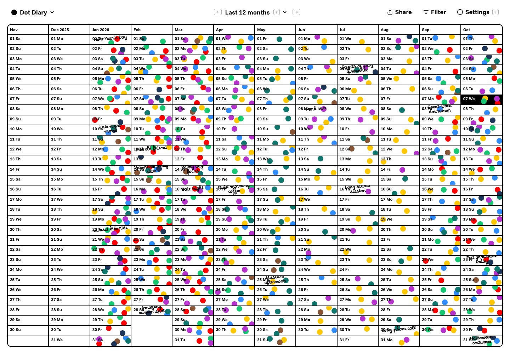
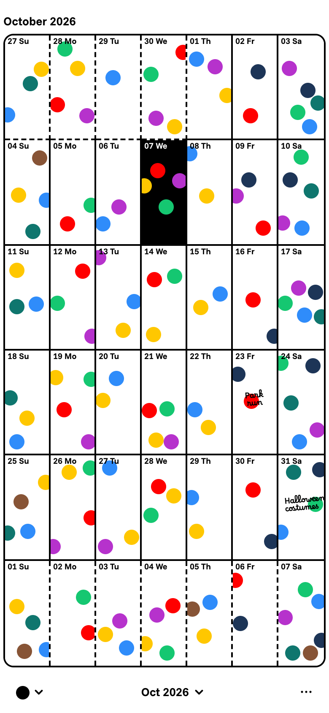
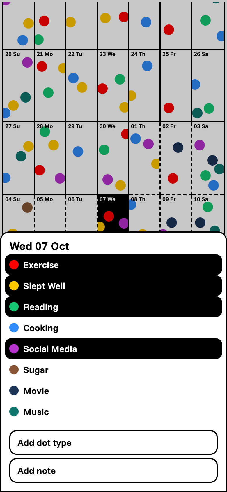
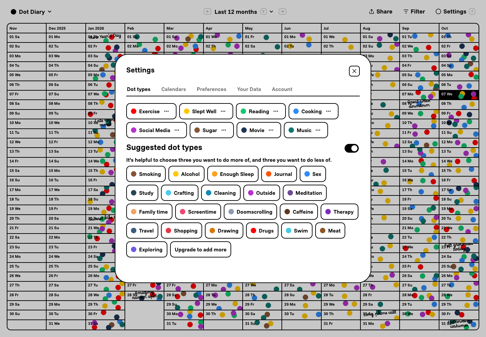

# Dot Diary

🔴 🟠 🟡 🟢 🔵 🟣

A diary made of colored dots. Track habits, remember small moments, and see patterns across your days, months, and years.

[Open Dot Diary](https://dot-diary.com) · [GitHub](https://github.com/brandonhaslegs/dot-diary) · [Radicle](https://radicle.network/nodes/oak.radicle.garden/rad:z3gkDi3uPJkesCqiwqjxbmLWefJep)



## What you can do

- Create your own dot types, choose their colors, and place dots on each day.
- Drag dots around a day and add short notes alongside them.
- Browse a year or the last 12 months on desktop, and scroll through months on mobile.
- Filter the calendar by dot type and show or hide notes.
- Rename, recolor, hide, or delete dot types in Settings.
- Choose light, dark, or system appearance, Monday-first weeks, and keyboard hints.
- Export and import your diary as JSON.
- Sign in with an email code to sync across devices, with local browser storage for persistence.
- Add the app to your home screen on supported devices.

The free plan supports six dot types. Unlimited adds more dot types, separate calendars, and shareable diary snapshots, with Stripe checkout and a billing portal.

## On mobile

The month view keeps your diary close at hand. Tap a day to choose a dot or add a note.

<p>
  
  
</p>

## Settings

Manage dot types, calendars, preferences, data imports and exports, and your account in one place.



Screenshots were captured from the local development app on October 7, 2026, using generated demo data rather than a personal diary. They include UI refinements that are not yet committed in this checkout.

## Stack

- **Frontend:** vanilla JavaScript with native ES modules, HTML, and CSS. No UI framework or frontend build step.
- **Storage and sync:** browser localStorage, Supabase Auth, and a Supabase database.
- **API:** Node.js handlers in `api/`, hosted as Vercel functions.
- **Billing:** Stripe, called from the server-side API.
- **Tests:** Node's built-in test runner; additional Playwright browser tests are in local development.

## Run locally

From the repository root, start a static server with Python 3:

```sh
python3 -m http.server 8788
```

Open [localhost:8788](http://localhost:8788). Use a server rather than opening `index.html` directly, because the app loads JavaScript modules.

For a populated preview without signing in, open [demo mode](http://localhost:8788/?demo=1). Demo edits are not saved to browser storage.

The Python server serves the frontend only. It does not execute the billing or sharing routes under `/api`. Use a Vercel development environment or deployment when working on those integrations.

## Backend setup

### Authentication and sync

The browser's Supabase project URL and publishable key are configured in `src/constants.js`. To run against your own project, replace both values and configure Supabase email-code authentication.

The sync code expects a `user_data` table with a unique `user_id`, a JSON `data` column, and an `updated_at` timestamp. Restrict reads and writes to the signed-in owner with row-level security. The repository does not currently include a complete bootstrap migration for this table.

### Billing and Unlimited access

Configure these environment variables for the Vercel API functions:

| Variable | Purpose |
| --- | --- |
| `SUPABASE_URL` | Supabase project URL used by the API. |
| `SUPABASE_ANON_KEY` | Public client key used to validate user sessions and access sharing with the caller's permissions. |
| `STRIPE_SECRET_KEY` | Server-only Stripe secret key. |
| `STRIPE_PRICE_MONTHLY` | Stripe price ID for the monthly plan. |
| `STRIPE_PRICE_YEARLY` | Stripe price ID for the yearly plan. |
| `PUBLIC_APP_URL` | Recommended public origin for checkout and billing-portal return URLs. |
| `UNLIMITED_BETA_EMAILS` | Optional comma-separated list of account emails with complimentary access. |

The email allowlist unlocks Unlimited without requiring Stripe to be configured. An additional permanent grant through admin-controlled `app_metadata.unlimited: true` is in local development and is not yet included in the published code.

Keep Stripe secrets and the complimentary-access allowlist in the server environment, outside source control.

### Sharing

The sharing API stores selected diary snapshots in `public_shares`. The existing table migration is in `supabase/migrations/`.

**Known limitation:** the current migration's SELECT policy allows reading all rows; it does not enforce access only through a known share ID. Review and tighten database access before using sharing for sensitive data. An unguessable link alone does not prevent direct table enumeration when the table is publicly readable.

## Tests

Run the committed regression tests with a modern Node.js installation:

```sh
node --test tests/sync-simulator.test.mjs tests/overlay-dismiss.test.mjs
```

These cover diary synchronization and overlay dismissal behavior.

### Test tooling in local development

The local working tree also contains billing regression tests, npm scripts, a
Playwright mobile interaction suite, and a GitHub Actions workflow. These are not
yet committed, so the following commands apply only once those files are available:

```sh
npm ci
npm test
npx playwright install chromium webkit
npm run test:mobile
```

The pending workflow uses Node.js 22. The mobile suite starts a Python preview
server and covers day editing, persistence, menus, filters, sharing dialogs, and
settings across phone sizes and landscape WebKit. It does not validate live
Stripe payments or production database permissions.

## Project layout

| Path | Contents |
| --- | --- |
| `index.html`, `styles.css` | App markup and styles. |
| `src/` | UI rendering, diary state, auth, sync, billing, sharing, and installation UI. |
| `api/` | Server-side billing and sharing endpoints. |
| `supabase/migrations/` | Database migrations currently included with the app. |
| `tests/` | Node regression tests; additional mobile tests are pending publication. |
| `docs/screenshots/` | Screenshots used in documentation. |
| `icons/`, `manifest.json` | Home-screen icons and web app manifest. |
| `privacy.html`, `impressum.html` | Legal pages. |
